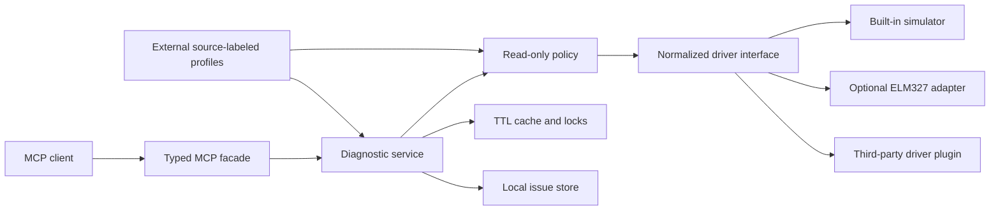
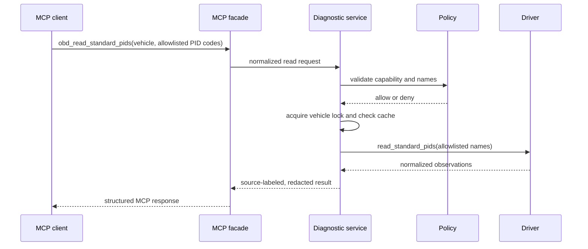

# Architecture

## Design goals

The system must remain useful without proprietary data, keep AI clients away
from raw diagnostic protocols, fail closed, and let hardware/OEM support evolve
without coupling it to the MCP transport.



## Trust boundaries

1. **MCP boundary** — accepts typed intent, never raw frames, service IDs, or
   adapter commands.
2. **Core boundary** — resolves a vehicle, serializes requests, checks policy,
   caches observations, and redacts identity.
3. **Driver boundary** — built-in drivers perform only normalized reads and
   cannot register additional MCP tools. Third-party drivers are disabled by
   default. Explicitly enabling one executes trusted Python code in-process;
   the interface constrains normal integration but is not a security sandbox.
4. **Profile boundary** — treats every external definition as untrusted data.
   Profiles can narrow allowed reads; they cannot make a mutable operation
   permissible.
5. **Vehicle boundary** — an adapter and the physical diagnostic connector are
   outside the process trust boundary. Hardware behavior must be validated
   independently.

## Package layout

```text
src/obd_mcp/
  cli.py             command and transport selection
  config.py          TOML parsing and loopback validation
  server.py          thin MCP tool facade
  domain.py          normalized structured models
  service.py         orchestration, cache, locks, identity redaction
  policy.py          protocol-independent safety policy
  profiles.py        declarative profile validation and lookup
  storage.py         local issue/timeline persistence
  drivers/
    base.py          driver protocol
    registry.py      built-ins and package entry points
    simulator.py     deterministic no-hardware implementation
    elm327.py        optional fixed-command adapter
```

## Request path



Failures at lookup, policy, profile validation, driver import, connection, or
decode stages are surfaced as bounded diagnostic errors. They do not fall back
to raw access.

## Extension contract

Driver plugins are discovered through Python package metadata:

```toml
[project.entry-points."obd_mcp.drivers"]
my_driver = "my_package.driver:create_driver"
```

A factory receives JSON-compatible options after the core's generic sensitive
key and VIN checks. The server injects the configured `vehicle_id` and
`display_name`; plugin options cannot override them. Unlike the strict schemas
for the built-in simulator and ELM327 drivers, plugin-specific option
validation belongs to the plugin factory.

Third-party discovery is disabled unless the configuration contains:

```toml
[extensions]
allow_third_party_drivers = true
```

The core remains authoritative for its policy, cache, concurrency, response
correlation, privacy checks, and tool exposure. That does not make an enabled
plugin safe: arbitrary in-process Python code can perform side effects outside
the driver interface. Operators must treat an enabled plugin as fully trusted.

Profiles are declarative JSON/TOML documents. Schema version 1 is UDS-only and
permits only the modeled `0x19` and `0x22` reads. Profiles carry provenance and
define only selected read identifiers. They cannot contain Python imports,
templates, scripts, raw request payloads, or new tool definitions.

`obd_read_ecu_snapshot` does not accept a caller-selected profile. The service
uses the profile bound to the configured vehicle. Without a bound profile, it
requests a normalized standard snapshot and accepts only allowlisted Mode 01
signals and DTC observations.

See [the driver plugin guide](driver-plugins.md) for the compatibility and
trust contract.

## Transport posture

- Stdio is the default and keeps stdout protocol-clean.
- Streamable HTTP binds to loopback only.
- DNS-rebinding protection from the MCP SDK remains enabled.
- HTTP request bodies are bounded before MCP JSON parsing.
- Remote bind, reverse proxy, TLS, and authentication are future work that
  require a separate threat-model update.

For built-in drivers, `obd-mcp check-config` validates configuration, profiles,
driver options, and optional dependency availability without constructing a
driver or connecting to hardware. Third-party entry-point metadata is examined
only after explicit opt-in; the command does not import the plugin module or
prove its behavior safe.

## Data posture

- The core stores local issue metadata, not raw bus captures.
- VIN-shaped configuration and public-domain values are rejected, including a
  final recursive check before tool output.
- The returned VIN fingerprint and redacted suffix are pseudonymous,
  deterministic vehicle-related data, not anonymous data.
- Simulator data is explicitly labeled synthetic.
- OEM and community data are mounted externally and retain source/license
  labels in results.

## Decisions

- [ADR-0001: Python core and thin MCP facade](adr/0001-python-core-and-thin-mcp-facade.md)
- [ADR-0002: External source-labeled profiles](adr/0002-external-source-labeled-profiles.md)
